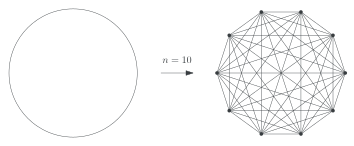
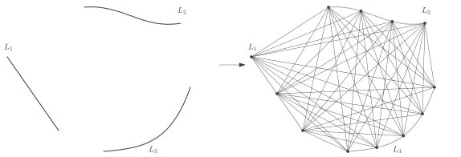
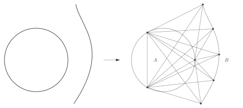

# Ipelets
A collection of ipelets that save me a lot of time when drawing figures.
To use, add the .ipe files into your `./ipelets` folder.

## Dense Graphs
Some functions to draw dense graphs. These are included in `k_clique.lua`.
The following graphs can be drawn:
- Complete graphs.
- Complete multipartite graphs.
- Complete split graphs.

### Usage
---
#### Complete graphs

A [_complete graph_](https://www.graphclasses.org/classes/gc_1241.html) is a graph with $n$ vertices where there is an edge for any pair of distinct vertices.

To draw a complete graph embedded into a circle for any number of vertices, follow:
1. Draw a circle using one of the three options of ipe.
2. Select the circle
3. Run "ipelets -> Dense Graphs -> Complete graph"
4. Enter the number of vertices and accept.

##### Example:
An example of a complete graph for $n=10$:

#### Complete multipartite graphs

A [_complete multipartite graph_](https://www.graphclasses.org/classes/gc_1249.html) consists of non-empty independent sets $S_i$ and $(x,y)$ is an edge whenever $x\in S_i$ and $y\in S_j$ with $i\neq j$.

To draw a multipartite graph with independent sets $S_1,\ldots,S_r$ where $|S_i| = n_i$ for all $i$, embedded into $r$ lines, follow:
1. Draw $r$ paths (lines, curves) $L_1,\ldots,L_r$.
2. Select them in **labelling order**: First $L_1$, then $L_2$, $L_3$, and so on.
3. Run "ipelets -> Dense Graphs -> Complete Multipartite Graph"
4. Enter the sizes of $S_1,\ldots,S_r$ in **this format**: $s_1,s_2,\ldots,s_r$ (no spaces).

##### Example:
An example with three independent sets where $n_1,n_2,n_3 = 3,4,5$:

#### Complete Split Graph

A [_complete split graph_](https://www.graphclasses.org/classes/gc_1242.html) is a graph that can be partitioned in an independent set and a clique such every vertex in the independent set is adjacent to every vertex in the clique.

To draw a complete split graph with a clique $A$ with $n$ vertices and independent set $B$ with $m$ vertices, follow:

1. Draw a circle and a path.
2. Select both.
3. Run "ipelets -> Dense Graphs -> Complete split graph"
4. Enter the sizes $n,m$ (no spaces).

##### Example:
An example with $n = 3 $ and $m = 4$:

## Intersection Graphs
Writing...

## Unwrap Circles
Writing...